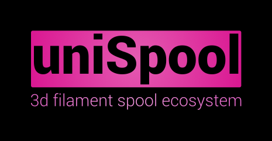

# The uniSpool project

## Motivation

I never cared much about filament spools for 12 years of 3d printing. But then I opened the box of pandora when buying Bambulab 3D printers with their AMS multimaterial systems in 2022.. From then I was constantly running into issues when I was able to acquire 2,5 kg spools on a cheap, or decided to use just cross brand everything I was interested in.
These filament winders available on **printables**, **thingiverse** or **makerworld** were also not the yellow of the egg for me. So decided to create my own during Christmas holidays 2024.

### Design paradigms

- Easy to modify / extend via interfaces
- Being able to adopt for new spools in the future without dropping the whole design.
- durability (obviously)
- motorized approach mandatory
- SoC based approach for beeing able to use software & sensoring in the future

## Ressources
All printable files will be released under https://makerworld.com/en/collections/3283952 on makerworld.com
